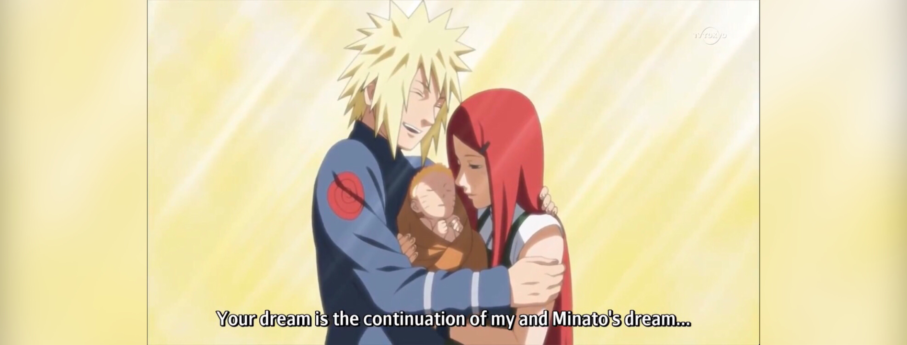

# **{{bot_name}}**

### Konichiwa 👋, myself {{bot_name}}, Konohagakure Yondaime Hokage. I do every work of a Hokage in a swift and clean way ⚡

[{ loading=lazy }](https://top.gg/bot/{{bot_discord_id}}){ target=_blank }
 [{ loading=lazy }](http://discord.com/users/{{bot_discord_id}}){ target=_blank }  { target=_blank }
 [{ loading=lazy }](https://top.gg/bot/{{bot_discord_id}}){ target=_blank }
 [{ loading=lazy }](https://minato-namikaze.readthedocs.io/en/latest/?badge=latest)

{ loading=lazy }

***

## About Me

{{bot_name}}, the versatile Discord bot, handles everything from admin tasks to fun and games. It is a multi-purpose bot that can be used for various purposes like moderation, fun, utility, and much more. It is a bot that is designed to make your server more interactive and fun. It has a lot of features that can be used to make your server more engaging and fun. It is a bot that is designed to make your server more interactive and fun. It has a lot of features that can be used to make your server more engaging and fun.

**{{bot_name}}** (**波風ミナト**, Namikaze Minato) was the **Fourth Hokage** (**四代目火影**, Yondaime Hokage, literally meaning: Fourth Fire Shadow) of Konohagakure. He was renowned all over the world as **Konoha's Yellow Flash** (**木ノ葉の黄色い閃光**, Konoha no Kiiroi Senkō, English TV: Yellow Flash of the Leaf). He died during the Nine-Tailed Demon Fox's Attack, sacrificing his life to seal a part of the Nine-Tails into his newborn son, Naruto Uzumaki.

## Get Started

[Invite Now :fontawesome-solid-link:](https://discord.com/oauth2/authorize?client_id={{bot_discord_id}}&permissions=8&redirect_uri=https%3A%2F%2Fminatonamikaze-invites.herokuapp.com%2Finvite&scope=applications.commands%20bot&response_type=code&state=cube12345%3F%2FBot%20Website){ .md-button target=_blank } [Get Started :fontawesome-solid-circle-play:](commands/index.md){ .md-button }

<!-- # Support Us
  -->
<!-- <a href="https://www.patreon.com/bePatron?u=20009768" target="_blank" data-patreon-widget-type="become-patron-button">Become a Patron!</a>  -->

# Contact Us

To contact us for queries please join our support server.

<iframe src="https://discord.com/widget?id=920190307595874304&theme=dark" width="350" height="500" allowtransparency="true" frameborder="0" sandbox="allow-popups allow-popups-to-escape-sandbox allow-same-origin allow-scripts"></iframe>

***

{ loading=lazy }

